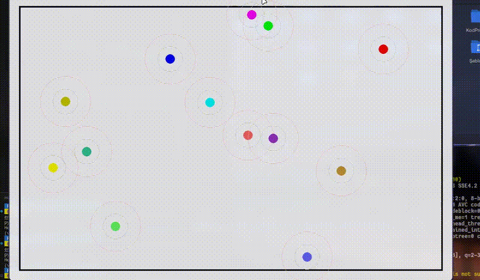

# 🔥 Yangın Söndürme Droneleri Sürüsü (Swarm-Based Firefighting Simulation)

Bu proje, orman yangınlarına müdahale eden, **sürü davranışı** gösteren otonom dronelerin simülasyonudur. Simülasyon, dronelerin yangına tepki verme, etkileşimli olarak konumlarını optimize etme ve yangını söndürme sürecini göstermektedir.

## 🎯 Amaç

- **Sürü zekası (swarm intelligence)** ile yangınlara müdahale stratejilerini modellemek
- Gerçek zamanlı simülasyon ile davranış temelli algoritmaları görselleştirmek
- Yangın yayılımı ve müdahale etkinliğini dinamik olarak analiz etmek

## 🚁 Özellikler

- Her biri farklı renkte otonom droneler (ajanlar)
- Gerçek zamanlı yangın yayılımı ve söndürme hesaplamaları
- Droneler arası etkileşim: çarpışma önleme, hizalanma, ayrılma
- Minimum müdahale ajanı sayısına göre dinamik yangın kontrolü
- Kontrol edilemeyen yangın uyarısı ve ayrılma moduna geçiş
- Basit görsel su püskürtme animasyonu

## 🧠 Kullanılan Teknolojiler

- `Python`
- `Pygame`
- Temel vektör matematiği ve fizik temelli hareket
- Sürü algoritmalarına (Boids benzeri) sade bir yaklaşım

## 🖼️ Ekran Görüntüsü

> 


## ⚙️ Nasıl Çalıştırılır?

```bash
pip install pygame
python firefighting_drones.py
